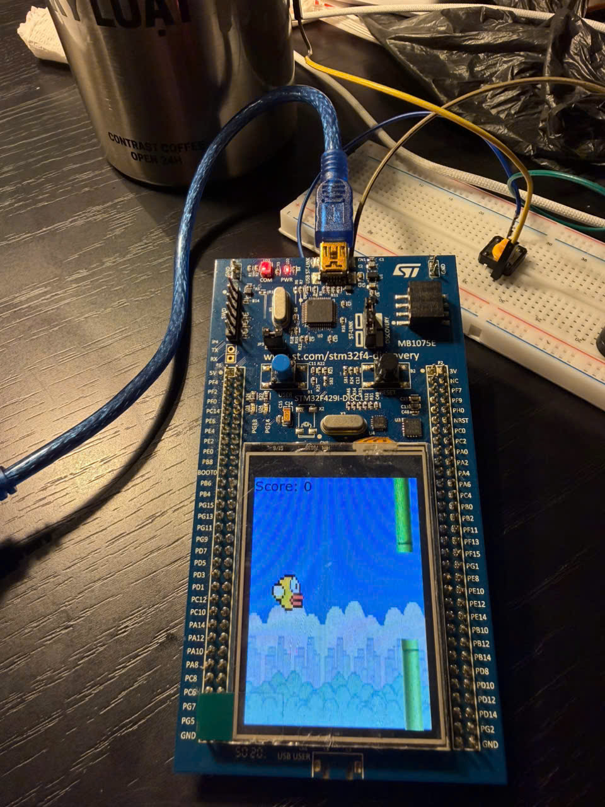

<br/>
<p align="center">
  <a href="https://github.com/ihbkaiser/ihbkaiser-Game-HeNhung20251">
    
  </a>

  <h3 align="center">FLAPPY BIRD GAME PROJECT</h3>

  <p align="center">
    Making flappybird game on STM32F429IZIT6-DISC0 card with TouchGFX
    <br/>
    <br/>
    
  
  </p>
</p>

<p align="center">
  
    

</p>

## Table Of Contents

* [About the Project](#about-the-project)
* [Built With](#built-with)
* [Getting Started](#getting-started)
  * [Prerequisites](#prerequisites)
  * [Installation](#installation)
* [Usage](#usage)
* [Roadmap](#roadmap)
* [Contributing](#contributing)
* [Authors](#authors)
* [Acknowledgements](#acknowledgements)

## About The Project

[](https://www.youtube.com/shorts/7jzeVExiOc0)



## Báo cáo

### 1. Tên project & mô tả
- **Tên project:** Game Flappy Bird trên STM32F429IZIT6-DISC0
- **Mô tả:** Xây dựng game Flappy Bird chạy trên STM32F429, hiển thị bằng TouchGFX. Người chơi điều khiển chim bay qua chướng ngại vật, tính điểm và hiển thị điểm cao nhất trong phiên.

### 2. Thiết kế phần cứng
- **Vi điều khiển/board:** STM32F429I-DISCO (STM32F429IZIT6)
- **Màn hình:** TFT LCD tích hợp (điều khiển bởi LTDC + DMA2D)
- **Điều khiển:** Cảm ứng màn hình tích hợp của STM32F429I-DISCO
- **Buzzer:** Cực **+** nối 3V, cực **-** nối **PA0** (GPIO Output, active-low)
- **Nguồn & kết nối:** Cấp nguồn qua USB ST-LINK

### 3. Thiết kế phần mềm

#### 3.1. Yêu cầu chức năng
- Hiển thị menu chính và cho phép bắt đầu game bằng chạm.
- Điều khiển chim nhảy bằng thao tác chạm trên màn hình game.
- Hiển thị điểm hiện tại trong game.
- Hiển thị màn hình Game Over với điểm và top score.
- Nút **BACK** để quay về menu.
- Buzzer PA0 được cấu hình sẵn nhưng không dùng cho thao tác nhảy.

#### 3.2. Chi tiết các chức năng và cách triển khai (very detail)

**a) Menu chính và vào game bằng chạm**
- TouchGFX nhận sự kiện chạm tại `Screen3View::handleClickEvent()`.
- Kiểm tra vị trí chạm có nằm trong vùng icon Flappy Bird (ô `selectedProgramBox`).
- Nếu hợp lệ thì gọi chuyển màn hình sang game.

Trích từ: `TouchGFX/gui/src/screen3_screen/Screen3View.cpp`
```cpp
void Screen3View::handleClickEvent(const touchgfx::ClickEvent& evt)
{
    if (evt.getType() != touchgfx::ClickEvent::RELEASED) return;
    const int16_t x = evt.getX(), y = evt.getY();
    if (x >= selectedProgramBox.getX() && x < selectedProgramBox.getX() + selectedProgramBox.getWidth() &&
        y >= selectedProgramBox.getY() && y < selectedProgramBox.getY() + selectedProgramBox.getHeight()) {
        application().gotoFlappyScreenScreenNoTransition();
    }
}
```

**b) Chạm màn hình điều khiển chim**
- TouchGFX nhận sự kiện chạm tại `FlappyScreenView::handleClickEvent()`.
- Khi màn hình nhận `ClickEvent::PRESSED`, game gọi `flap()` để bắt đầu game nếu cần và gán vận tốc hướng lên cho chim.
- `handleKeyEvent()` không còn điều khiển chim, nên nút cứng không còn là input gameplay.

Trích từ: `TouchGFX/gui/src/flappyscreen_screen/FlappyScreenView.cpp`
```cpp
void FlappyScreenView::handleClickEvent(const touchgfx::ClickEvent& evt)
{
    if (evt.getType() == touchgfx::ClickEvent::PRESSED) {
        flap();
    }
}

void FlappyScreenView::flap()
{
    if (isDying) {
        return;
    }

    if (!gameRunning) {
        gameRunning = true;
    }

    birdVel_fp = -800;
}
```

**d) Hiển thị điểm trong game**
- Trong `FlappyScreenView`, khi chim vượt qua một cột ống thì tăng `gameScore`.
- Cập nhật text bằng `TypedText` + wildcard để hiện số.

Trích từ: `TouchGFX/gui/src/flappyscreen_screen/FlappyScreenView.cpp`
```cpp
void FlappyScreenView::updateScoreText()
{
    touchgfx::Unicode::snprintf(scoreTextBuffer, SCORETEXT_SIZE, "%u", (unsigned)gameScore);
    scoreText.setTypedText(touchgfx::TypedText(T___SINGLEUSE_KDY8)); // "Score: <value>"
    scoreText.setWildcard(scoreTextBuffer);
    scoreText.resizeToCurrentText();
    scoreText.invalidate();
}
```

**e) Game Over + hiển thị điểm và top score**
- Khi va chạm hoặc rơi khỏi màn hình: gọi `endGame()`.
- Ghi `score` và cập nhật `topScore` (RAM, reset khi board reset).
- Chuyển sang Screen2 (Game Over) và hiển thị 2 giá trị.

Trích từ: `TouchGFX/gui/src/flappyscreen_screen/FlappyScreenView.cpp`
```cpp
void FlappyScreenView::endGame()
{
    score = gameScore;
    if (gameScore > topScore) topScore = gameScore;
    gameRunning = false;
    application().gotoScreen2ScreenNoTransition();
}
```

**f) Nút BACK ở Game Over**
- Có vùng nút BACK (X=0, Y=249, W=240, H=71).
- Khi chạm trong vùng này, quay lại menu.

Trích từ: `TouchGFX/gui/src/screen2_screen/Screen2View.cpp`
```cpp
void Screen2View::handleClickEvent(const touchgfx::ClickEvent& evt)
{
    if (evt.getType() != touchgfx::ClickEvent::RELEASED) return;
    const int16_t x = evt.getX(), y = evt.getY();
    if (x >= exitBox.getX() && x < exitBox.getX() + exitBox.getWidth() &&
        y >= exitBox.getY() && y < exitBox.getY() + exitBox.getHeight()) {
        application().gotoScreen3ScreenNoTransition();
    }
}
```

#### 3.3. Logic game
- **Mỗi tick (mỗi khung hình):** Khi người chơi chạm màn hình, chương trình **gán vận tốc hướng lên** bằng cách đặt `birdVel_fp = -800` (giá trị âm nghĩa là đi lên trong hệ trục). Đồng thời, ở mọi tick, chim luôn bị trọng lực kéo xuống theo tham số `gravity_fp` (ví dụ `50`), nên sau khi nhảy lên sẽ rơi tự do dần về phía dưới.
- **Ống di chuyển & vòng lặp vô hạn:** Các ống được lưu trong một danh sách hữu hạn (mảng 4 ống trên màn hình). Mỗi tick, toàn bộ ống dịch sang trái theo tốc độ `speed`. Khi một ống đi ra khỏi màn hình bên trái, nó sẽ được đưa trở lại phía bên phải (offset theo `spacing`) để tạo cảm giác màn chơi vô hạn.
- **Va chạm (AABB collision):** Mỗi ống có một “hộp bao” (Axis‑Aligned Bounding Box). Chim cũng có hộp bao theo tọa độ `(x, y, width, height)`. Va chạm xảy ra khi hai hộp bao **chồng lấn**:
  - Trục X chồng lấn: `bird.x < pipe.x + pipe.w` **và** `bird.x + bird.w > pipe.x`
  - Trục Y chồng lấn: `bird.y < pipe.y + pipe.h` **và** `bird.y + bird.h > pipe.y`
  - Nếu chồng lấn với **ống trên** hoặc **ống dưới** thì Game Over.
- **Tính điểm & kết thúc:** Khi chim vượt qua một cột ống (ống đã đi qua bên trái chim) thì cộng **+1** điểm. Game kết thúc khi chim chạm ống hoặc rơi khỏi màn hình; điểm cuối cùng được lưu lại. Nếu điểm này cao hơn `TopScore` thì cập nhật `TopScore`.

### 4. Danh sách thành viên & đóng góp
- **An:** Lập trình logic cốt lõi của game, mô phỏng chuyển động vật lý của chim và quản lý chướng ngại vật.
- **Tùng:** Thiết kế giao diện (UI), hoạt ảnh và quản lý điều hướng, chuyển đổi màn hình trong game.
- **Cường:** Cấu hình phần cứng hệ thống nhúng, điều khiển các đèn LED báo hiệu vật lý.
- **Quân:** Tích hợp hệ thống phần mềm, lập trình đa nhiệm FreeRTOS, tối ưu hiệu năng hiển thị và kiểm thử lỗi.

### Course Information

- Embedded Systems Assignment  (20252) - HUST
- Topic: Flappy Bird Game
- **Nhóm: 11** 

### Game Logic

- Main menu: tap the Flappy Bird icon tile to start the game.
- In-game: tap the screen to make the bird jump.
- Game over: tap the **BACK** button at the bottom to return to the main menu.
- Score increases when the bird passes a pipe column.

## Built With

The technologies I used during the project are as follows:

* [STM32CubeIDE](https://www.st.com/en/development-tools/stm32cubeide.html)
* [TouchGFX](https://www.st.com/en/development-tools/touchgfxdesigner.html)

## Getting Started

I will explain how to load the project onto your own board here.

### Prerequisites

You should have STM32CubeIDE and TouchGFX installed on your computer.
The links have been provided in the [Built With](#built-with) section.

> **Lưu ý:** Dự án yêu cầu **TouchGFX 4.22.1** để build và chạy đúng.

### Installation

Clone the repo

```sh
git clone https://github.com/ihbkaiser/Game-HeNhung20251.git
```


## Usage

After downloading the project to your computer, navigate to the 'STM32CubeIDE' folder inside the project folder and open the '.cproject' file with STM32CubeIDE. Once you have opened the project in the IDE, you can load it onto your STM32F429IZIT6-DISC0 board through the IDE.

### How to Run (Quick Steps)

1. Open `STM32CubeIDE/.cproject` in STM32CubeIDE.
2. Build the project (Debug configuration is fine).
3. Connect the STM32F429I-DISCO board via ST-LINK USB.
4. Click **Debug** or **Run** to flash and start.

### Hardware note: no external buzzer mode

Current feedback works without extra wiring when the STM32F429I-DISCO is only connected to the computer by USB. Game events use the onboard LEDs only. External PA0 buzzer output is disabled by default with `GAME_FEEDBACK_ENABLE_BUZZER 0U` in `Core/Src/main.c`; set it to `1U` only if a buzzer is wired as documented.

## Roadmap

See the [open issues](https://github.com/ihbkaiser/ihbkaiser-Game-HeNhung20251/issues) for a list of proposed features (and known issues).

## Contributing

* If you have suggestions for adding or removing projects, feel free to [open an issue](https://github.com/ihbkaiser/ihbkaiser-Game-HeNhung20251/issues/new) to discuss it.
* Please make sure you check your spelling and grammar.
* Create individual PR for each suggestion.

### Creating A Pull Request

1. Fork the Project
2. Create your Feature Branch (`git checkout -b feature/AmazingFeature`)
3. Commit your Changes (`git commit -m 'Add some AmazingFeature'`)
4. Push to the Branch (`git push origin feature/AmazingFeature`)
5. Open a Pull Request

